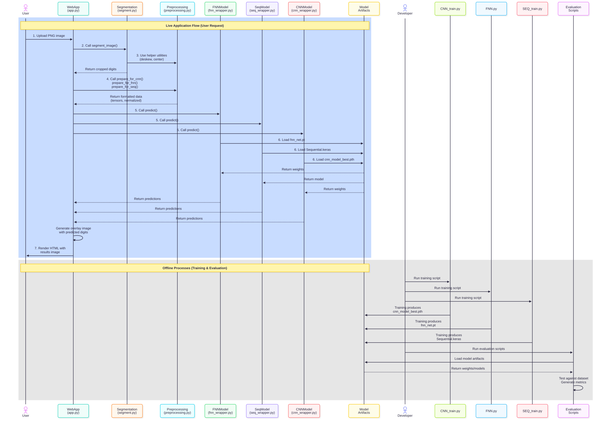

# Intelligent Systems - Handwritten Character Recognition

This project is a web-based application for recognizing handwritten digits using various machine learning models. Users can draw a digit on a canvas or upload an image, and the application will predict the digit using pre-trained Convolutional Neural Network (CNN), Feedforward Neural Network (FNN), and Sequential models. The project also explores extending the dataset from MNIST to the more complex EMNIST dataset.

## Instructions

To get a local copy up and running, follow these simple steps.

### Prerequisites

* Python 3.8+
* pip (Python package installer)

### Installation & Setup

1.  **Clone the repository:**
    ```sh
    git clone [https://github.com/your_username/COS30018-Intelligent-Systems-Team-Project-Option-B.git](https://github.com/your_username/COS30018-Intelligent-Systems-Team-Project-Option-B.git)
    cd COS30018-Intelligent-Systems-Team-Project-Option-B
    ```

2.  **Create and activate a virtual environment (recommended):**
    * **macOS/Linux:**
        ```sh
        python3 -m venv venv
        source venv/bin/activate
        ```
    * **Windows:**
        ```sh
        python -m venv venv
        .\venv\Scripts\activate
        ```

3.  **Install the required packages:**
    ```sh
    pip install -r requirements.txt
    ```

4.  **Run the Flask application:**
    ```sh
    cd src/GUI
    python app.py
    ```

5.  Open your web browser and navigate to `http://127.0.0.1:5000` to use the application.

## Project Architecture

The application is built with a Python Flask backend and a simple HTML/CSS/JavaScript front-end. The core logic is designed to process user input, feed it into the trained models, and return the prediction.

### Application Flow

1.  **User Input**: The user draws a digit on the HTML canvas or uploads an image file.
2.  **Data Transmission**: The drawing or uploaded image is sent to the Flask backend.
3.  **Preprocessing**: The backend receives the image and preprocesses it to match the format required by the models (e.g., resizing to 28x28 pixels, converting to grayscale, and normalizing pixel values).
4.  **Model Inference**: The preprocessed image is passed to the selected trained model (CNN, FNN, or Sequential) for prediction.
5.  **Return Prediction**: The model's prediction is sent back to the front-end.
6.  **Display Result**: The front-end displays the predicted digit to the user.

### Application Flow Sequence Diagram


## Project Structure

The project is organized into distinct modules for data, source code (including the GUI, models, and utilities), and saved assets.


## Evaluation Summary

The table below shows the accuracy scores for each of the implemented models on the standard MNIST test dataset.

| Model | Accuracy |
| :---- |:--------:|
| **CNN** |  99.11%  |
| **SEQ** |  95.97%  |
| **FNN** |  95.98%  |
| **CNN+**|  86.17%  |


### 1. Dataset Construction and Conversion

The EMNIST dataset was constructed by converting images from the NIST Special Database 19. The conversion pipeline was designed to make the images compatible with the original MNIST format:
1.  A small Gaussian blur was applied to the original images.
2.  A bounding box was extracted around each character.
3.  The character was centered within a square frame, adding a 2-pixel border.
4.  The final image was resized to a **28x28 pixel** grayscale image using bicubic interpolation.

### 2. Six Dataset Splits/Variants

The EMNIST dataset is available in several splits, each with different class structures and sample sizes.

| Split Name | Classes | Total Samples | Notes |
| :--------- | :-----: | :-----------: | :------------------------------------------------------------------- |
| **ByClass** |   62    |    814,255    | Full set with distinct uppercase and lowercase letters; unbalanced.  |
| **ByMerge** |   47    |    814,255    | Merged visually similar character pairs (e.g., 'o' and 'O').         |
| **Balanced**|   47    |    131,600    | A balanced subset of ByMerge, with an equal number of samples per class. |
| **Letters** |   26    |    145,600    | Contains only letters (both cases are merged into single classes).   |
| **Digits** |   10    |    280,000    | An extended, balanced set of digits only.                            |
| **MNIST** |   10    |    70,000     | The original MNIST dataset, for comparison.                          |

### Reference:

[EMNIST: an extension of MNIST to handwritten letters](https://arxiv.org/pdf/1702.05373v1)
[Kaggle - EMNIST (Extended MNIST)](https://www.kaggle.com/datasets/crawford/emnist/data)

> **Citations:**
> Cohen, G., Afshar, S., Tapson, J., & van Schaik, A. (2017). EMNIST: an extension of MNIST to handwritten letters. Retrieved from http://arxiv.org/abs/1702.05373