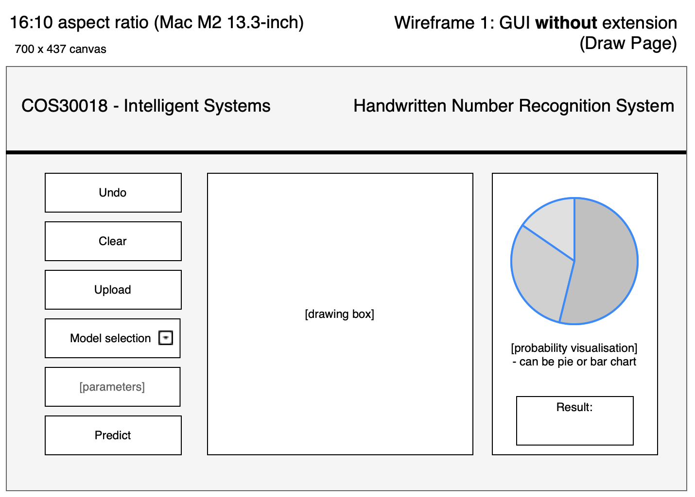
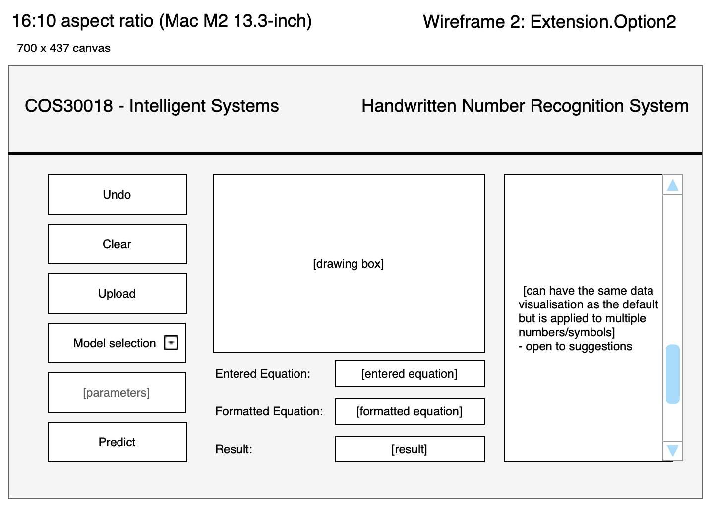

# Documentation for GUI wireframe/layout 
## Version 1 - 20/08/2024

**Common Attribute Fields**
- Undo: undoing last stroke drawn in the 'drawing box'
- Clear: clear entire canvas
- Upload: upload .png image for prediction
- Model Selection: ML model selection
- Parameters: enables users to input a customer parameter on the training size
- Predict: predicts number based on the image trained on the ML model and set parameters.

1. GUI without extension

This is the default GUI wireframe without any extension. This can also be built-in with extension 1 in which, depending on how the backend works, we can either have a toggle to switch between numbers and alphabets prediction or have them be integrated in a single setting.

- Left panel: action buttons for users (refer descriptions above)
- Center: canvas for users to draw on
- Right panel: shows prediction and visualises prediction accuracy (e.g. via bar chart)

2. GUI with extension (option 2)

This follows the first wireframe but is integrated within the second extension (arithmetic identification and operations)

- Left panel: action buttons for users (refer descriptions above)
- center: canvas for users to draw on and the entered and formatted equation and the result for the arithmetic operation
- right panel: will have the same data visualisation concepts and is up for discussion on how it's formatted
